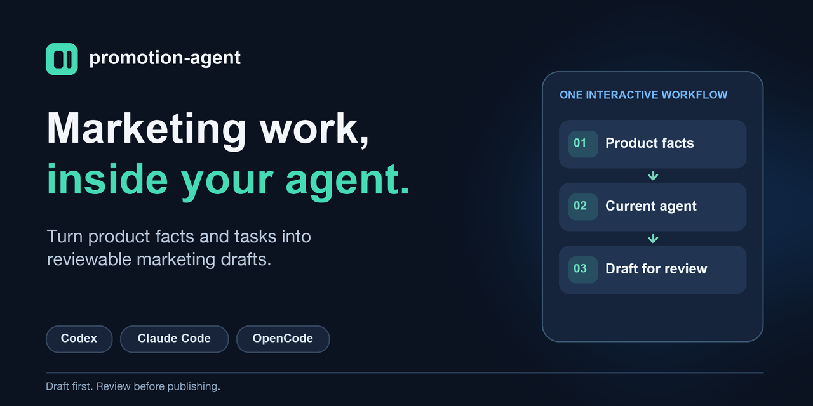

# promotion-agent

An interactive marketing workflow for Codex, Claude Code, and OpenCode. Open this repo in your agent, select a product, and prepare useful marketing work using that product's facts, tasks, and logs.

Source: [github.com/apsquared/promotion-agent](https://github.com/apsquared/promotion-agent) · [MIT license](LICENSE)



The **current agent does the work in your conversation**. There is no AI CLI runner, authentication probe, required web app, or background scheduler.

## How it works

Open this repository in Codex, Claude Code, or OpenCode and talk to your agent:

1. **“Set up BarGPT for promotion. Its repo is at /path/to/bargpt.”** The agent reads your product's instructions and marketing history, handles local setup, and summarizes the facts it will use. It preserves existing work and asks only for missing information that matters.
2. **“Draft one X post. Keep it as a draft.”** It chooses an angle using your product facts and recent posts, saves the draft, and shows you the exact copy and sources.
3. **“Make it shorter and focus on this benefit.”** Review and revise in the same conversation. Your agent handles the files and local helpers.
4. **“What's the status?”** It reports saved drafts, actual outcomes, pending work, and a useful next step.

You can also ask for a directory submission kit, relevant threads with draft replies, a blog proposal, SEO page proposals, or competitor analysis with a shortlist of verified public mentions. A draft request can run without installation; setup adds a portable workflow and local helpers to your selected product. Drafts remain drafts until a separately authorized action is actually verified.

No terminal checklist, database setup, or hash copying is needed from you. The agent runs available local tools and explains any environment limitation. Setup uses Node 22.14+ for the helpers; the agent handles the source build when needed. A preview-only request stops before installation, and existing custom files remain yours.

For an explicit entry point, use `$promotion-agent` in Codex or `/promote` in Claude Code/OpenCode, followed by the same conversational request. If discovery has not refreshed, ask the current agent to read `templates/WORKFLOW.md` directly. In an installed product, that path is `.promotion-agent/templates/WORKFLOW.md`.

**Try it:** [a conversational smoke test with BarGPT](docs/MANUAL-SMOKE-TEST.md). Native menu invocation and this new conversational setup flow still need live host acceptance; helper tests alone do not verify the conversation.

## Competitor analysis and mention discovery

Ask **“Analyze our competitors and find where people are talking about them.”** The agent compares relevant competitors, searches public discussions and reviews, verifies source URLs, and ranks opportunities to engage or improve positioning. Reports distinguish independent discussion from vendor promotion, verified mentions from inaccessible leads, and observations from inference. Optional reply drafts stay drafts.

Use `$promotion-competitors` in Codex or `/promote-competitors` in Claude Code/OpenCode, with a selected product and any competitors or date range you want to focus on. The main promotion workflow also recognizes this activity. [Research instructions](templates/activities/competitor-analysis.md) travel with installed projects; task-linked reports appear in the local review desk for prompt handoff. No automatic posting or recurring monitoring is started.

## Optional local review desk

A Next.js frontend provides a compact task inbox with side-by-side materials and saved draft previews. Search/filter tasks, inspect SQLite state and history, add review notes, then **copy a prompt back to your agent** to prepare, revise, act or verify. Refresh to see newly saved results.

Ask the agent to open the review desk for one selected product and optional local database. It handles the launcher and opens the private local session. The app reads existing data; copying a prompt does not execute an action or record approval. See [review desk setup and deployment limits](docs/REVIEW-UI.md). Next.js/Vercel build configuration is included; hosted access to local data requires a separate data adapter.

## Developer reference

Requires Node 22.14+. Building/onboarding this source checkout uses its pinned development dependencies; an installed product needs no package install, model credentials or external database for drafting.

```sh
npm run promotion -- inspect --project examples/example-desk
npm run promotion -- prepare --project examples/example-desk --task T-001
npm test
```

Helpers inspect/prepare tasks without changing files. Explicit completion uses the existing SQLite, project lock, content-hash and atomic-write checks. Drafting does not require a database. No helper invokes an AI provider or launches an agent.

Task-linked `record` writes a local evidence account without SQLite; `state` and `disposition` expose optional skipped/snoozed state. `complete` now requires the reviewed `verified-complete` record path and hash in addition to the task hash. The agent must verify the underlying action; the helper only validates the record and file preconditions. See [interactive use](docs/INTERACTIVE.md).

## Project guidance

- [Canonical workflow](templates/WORKFLOW.md): one activity, evidence-grounded facts, draft/review defaults.
- [Plan](docs/PLAN.md) and [handoff](docs/HANDOFF.md): current scope and next work.
- [Architecture](docs/ARCHITECTURE.md): interactive host and local data boundaries.
- [Storage](docs/STORAGE.md) and [contracts](schemas/README.md): optional infrastructure already implemented.
- [Invocation compatibility](docs/COMPATIBILITY.md): native entry points and verification limits.
- [Manual smoke test](docs/MANUAL-SMOKE-TEST.md): install into an existing BarGPT checkout, invoke the agent, and review one draft.
- [P05 interactive evidence](docs/P05-VERIFICATION.md): fictional Codex-session drafts, duplicate checks and host limits.
- [Extraction record](docs/EXTRACTION.md), [contributing](CONTRIBUTING.md), and [license](LICENSE).

Select product repos explicitly; preserve their custom instructions and unrelated work. No automatic publishing, spending, commit or push. The npm package remains private; source availability on GitHub does not mean the package is published to npm. A packed tarball was installed in an isolated temporary environment, but no public npm publication or real product installation has occurred. [Release status and steps to published/live use](docs/RELEASE.md) cover native host checks, an outside-founder trial, source provenance, compatibility and publication.

The [social preview image](assets/opengraph.png) is ready for upload in the repository's GitHub **Settings → Social preview** once a public remote is available. Keeping the image in the README alone does not set GitHub's link preview.
